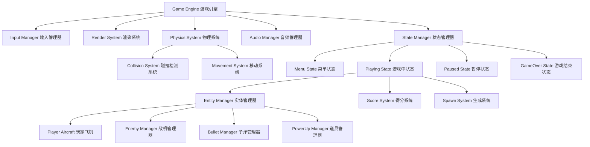

# 设计文档：雷霆战机游戏

## 概述

雷霆战机是一款基于HTML5 Canvas的网页垂直卷轴射击游戏。游戏采用面向对象的架构设计，使用JavaScript/TypeScript实现，通过游戏循环驱动所有游戏对象的更新和渲染。

核心设计理念：
- **模块化设计**：将游戏功能分解为独立的模块（实体、系统、管理器）
- **实体-组件模式**：游戏对象（飞机、子弹、道具）作为实体，具有共同的接口
- **事件驱动**：使用事件系统处理碰撞、得分、游戏状态变化
- **性能优化**：使用对象池减少垃圾回收，优化碰撞检测算法

## 架构

### 整体架构图



### 架构层次

1. **核心层（Core Layer）**
   - Game Engine：主游戏循环，协调所有系统
   - State Manager：管理游戏状态转换
   - Event Bus：事件发布/订阅系统

2. **系统层（System Layer）**
   - Input Manager：处理键盘/鼠标输入
   - Render System：Canvas渲染
   - Physics System：物理更新和碰撞检测
   - Audio Manager：音效和音乐播放

3. **游戏逻辑层（Game Logic Layer）**
   - Entity Manager：管理所有游戏实体
   - Score System：得分计算和存储
   - Spawn System：敌机和道具生成逻辑

4. **实体层（Entity Layer）**
   - Player Aircraft：玩家飞机实体
   - Enemy Aircraft：敌机实体
   - Bullet：子弹实体
   - PowerUp：道具实体

## 组件与接口

### 核心接口

#### GameObject 接口

所有游戏对象的基础接口：

```typescript
interface GameObject {
  id: string;
  x: number;
  y: number;
  width: number;
  height: number;
  active: boolean;
  
  update(deltaTime: number): void;
  render(context: CanvasRenderingContext2D): void;
  destroy(): void;
}
```

#### Collidable 接口

可碰撞对象的接口：

```typescript
interface Collidable extends GameObject {
  collisionBox: Rectangle;
  collisionType: CollisionType;
  
  onCollision(other: Collidable): void;
  checkCollision(other: Collidable): boolean;
}
```

#### Movable 接口

可移动对象的接口：

```typescript
interface Movable extends GameObject {
  velocityX: number;
  velocityY: number;
  speed: number;
  
  move(deltaTime: number): void;
  setVelocity(vx: number, vy: number): void;
}
```

### 主要组件

#### 1. Game Engine（游戏引擎）

游戏的核心控制器，负责游戏循环和系统协调。

```typescript
class GameEngine {
  private canvas: HTMLCanvasElement;
  private context: CanvasRenderingContext2D;
  private stateManager: StateManager;
  private lastFrameTime: number;
  private isRunning: boolean;
  
  constructor(canvasId: string);
  
  start(): void;
  stop(): void;
  pause(): void;
  resume(): void;
  
  private gameLoop(currentTime: number): void;
  private update(deltaTime: number): void;
  private render(): void;
}
```

**职责：**
- 管理游戏主循环（使用requestAnimationFrame）
- 计算帧间隔时间（deltaTime）
- 协调状态管理器
- 处理游戏启动、暂停、恢复

#### 2. State Manager（状态管理器）

管理游戏的不同状态及其转换。

```typescript
enum GameStateType {
  MENU = 'menu',
  PLAYING = 'playing',
  PAUSED = 'paused',
  GAME_OVER = 'gameOver'
}

interface GameState {
  type: GameStateType;
  
  enter(): void;
  exit(): void;
  update(deltaTime: number): void;
  render(context: CanvasRenderingContext2D): void;
  handleInput(input: InputState): void;
}

class StateManager {
  private currentState: GameState;
  private states: Map<GameStateType, GameState>;
  
  registerState(type: GameStateType, state: GameState): void;
  changeState(type: GameStateType): void;
  getCurrentState(): GameState;
  
  update(deltaTime: number): void;
  render(context: CanvasRenderingContext2D): void;
}
```

**状态说明：**
- **MenuState**：显示开始菜单，等待玩家开始游戏
- **PlayingState**：游戏进行中，处理所有游戏逻辑
- **PausedState**：游戏暂停，显示暂停菜单
- **GameOverState**：游戏结束，显示得分和重新开始选项

#### 3. Input Manager（输入管理器）

处理玩家输入（键盘和鼠标）。

```typescript
interface InputState {
  keys: Set<string>;
  mouseX: number;
  mouseY: number;
  mouseDown: boolean;
}

class InputManager {
  private inputState: InputState;
  private keyBindings: Map<string, string>;
  
  constructor(canvas: HTMLCanvasElement);
  
  getInputState(): InputState;
  isKeyPressed(action: string): boolean;
  getMousePosition(): { x: number; y: number };
  isMouseDown(): boolean;
  
  private handleKeyDown(event: KeyboardEvent): void;
  private handleKeyUp(event: KeyboardEvent): void;
  private handleMouseMove(event: MouseEvent): void;
  private handleMouseDown(event: MouseEvent): void;
  private handleMouseUp(event: MouseEvent): void;
}
```

**默认键位绑定：**
- 方向键/WASD：移动
- 空格键/鼠标左键：射击
- P键：暂停
- ESC键：返回菜单

#### 4. Entity Manager（实体管理器）

管理所有游戏实体的生命周期。

```typescript
class EntityManager {
  private entities: Map<string, GameObject>;
  private entitiesToAdd: GameObject[];
  private entitiesToRemove: string[];
  
  addEntity(entity: GameObject): void;
  removeEntity(id: string): void;
  getEntity(id: string): GameObject | undefined;
  getEntitiesByType<T extends GameObject>(type: new (...args: any[]) => T): T[];
  
  update(deltaTime: number): void;
  render(context: CanvasRenderingContext2D): void;
  clear(): void;
  
  private processAdditions(): void;
  private processRemovals(): void;
}
```

#### 5. Player Aircraft（玩家飞机）

玩家控制的战斗机。

```typescript
class PlayerAircraft implements GameObject, Collidable, Movable {
  id: string;
  x: number;
  y: number;
  width: number;
  height: number;
  active: boolean;
  
  velocityX: number;
  velocityY: number;
  speed: number;
  
  health: number;
  maxHealth: number;
  fireRate: number;
  lastFireTime: number;
  weaponLevel: number;
  
  invincible: boolean;
  invincibleTime: number;
  
  constructor(x: number, y: number);
  
  update(deltaTime: number): void;
  render(context: CanvasRenderingContext2D): void;
  move(deltaTime: number): void;
  fire(): Bullet[];
  takeDamage(damage: number): void;
  heal(amount: number): void;
  upgradeWeapon(): void;
  
  onCollision(other: Collidable): void;
  checkCollision(other: Collidable): boolean;
}
```

**属性说明：**
- `health`：当前生命值（初始3）
- `fireRate`：射击间隔（毫秒）
- `weaponLevel`：武器等级（1-3，影响子弹数量）
- `invincible`：无敌状态（受伤后短暂无敌）

#### 6. Enemy Aircraft（敌机）

敌对飞机实体。

```typescript
enum EnemyType {
  BASIC = 'basic',      // 基础敌机：直线下降，不射击
  SHOOTER = 'shooter',  // 射击敌机：直线下降，定期射击
  ZIGZAG = 'zigzag',    // 之字形敌机：左右移动
  BOSS = 'boss'         // Boss敌机：高血量，复杂移动模式
}

class EnemyAircraft implements GameObject, Collidable, Movable {
  id: string;
  x: number;
  y: number;
  width: number;
  height: number;
  active: boolean;
  
  velocityX: number;
  velocityY: number;
  speed: number;
  
  type: EnemyType;
  health: number;
  scoreValue: number;
  fireRate: number;
  lastFireTime: number;
  
  movementPattern: MovementPattern;
  
  constructor(x: number, y: number, type: EnemyType);
  
  update(deltaTime: number): void;
  render(context: CanvasRenderingContext2D): void;
  move(deltaTime: number): void;
  fire(): Bullet | null;
  takeDamage(damage: number): void;
  
  onCollision(other: Collidable): void;
  checkCollision(other: Collidable): boolean;
}
```

**敌机类型特性：**
- **BASIC**：1生命值，10分，速度100px/s
- **SHOOTER**：2生命值，20分，速度80px/s，每2秒射击
- **ZIGZAG**：2生命值，30分，速度120px/s，左右摆动
- **BOSS**：20生命值，200分，速度50px/s，复杂射击模式

#### 7. Bullet（子弹）

射击物体。

```typescript
enum BulletOwner {
  PLAYER = 'player',
  ENEMY = 'enemy'
}

class Bullet implements GameObject, Collidable, Movable {
  id: string;
  x: number;
  y: number;
  width: number;
  height: number;
  active: boolean;
  
  velocityX: number;
  velocityY: number;
  speed: number;
  
  owner: BulletOwner;
  damage: number;
  
  constructor(x: number, y: number, owner: BulletOwner, velocityY: number);
  
  update(deltaTime: number): void;
  render(context: CanvasRenderingContext2D): void;
  move(deltaTime: number): void;
  
  onCollision(other: Collidable): void;
  checkCollision(other: Collidable): boolean;
}
```

#### 8. PowerUp（道具）

可收集的增强道具。

```typescript
enum PowerUpType {
  WEAPON_UPGRADE = 'weaponUpgrade',  // 武器升级
  HEALTH = 'health',                  // 生命恢复
  SHIELD = 'shield'                   // 护盾（短暂无敌）
}

class PowerUp implements GameObject, Collidable, Movable {
  id: string;
  x: number;
  y: number;
  width: number;
  height: number;
  active: boolean;
  
  velocityX: number;
  velocityY: number;
  speed: number;
  
  type: PowerUpType;
  
  constructor(x: number, y: number, type: PowerUpType);
  
  update(deltaTime: number): void;
  render(context: CanvasRenderingContext2D): void;
  move(deltaTime: number): void;
  
  onCollision(other: Collidable): void;
  checkCollision(other: Collidable): boolean;
  apply(player: PlayerAircraft): void;
}
```

#### 9. Collision System（碰撞检测系统）

处理所有碰撞检测。

```typescript
interface Rectangle {
  x: number;
  y: number;
  width: number;
  height: number;
}

class CollisionSystem {
  checkCollision(a: Rectangle, b: Rectangle): boolean;
  
  checkPlayerBulletCollisions(
    bullets: Bullet[], 
    enemies: EnemyAircraft[]
  ): CollisionEvent[];
  
  checkEnemyBulletCollisions(
    bullets: Bullet[], 
    player: PlayerAircraft
  ): CollisionEvent[];
  
  checkPlayerEnemyCollisions(
    player: PlayerAircraft, 
    enemies: EnemyAircraft[]
  ): CollisionEvent[];
  
  checkPlayerPowerUpCollisions(
    player: PlayerAircraft, 
    powerUps: PowerUp[]
  ): CollisionEvent[];
  
  processCollisions(events: CollisionEvent[]): void;
}
```

**碰撞检测算法：**
- 使用AABB（轴对齐边界框）矩形碰撞检测
- 优化：空间分区（网格划分）减少检测次数
- 每帧检测所有活跃实体的碰撞

#### 10. Spawn System（生成系统）

控制敌机和道具的生成。

```typescript
interface SpawnConfig {
  enemySpawnRate: number;      // 敌机生成间隔（毫秒）
  difficultyIncreaseRate: number; // 难度增加速率
  powerUpDropChance: number;   // 道具掉落概率（0-1）
}

class SpawnSystem {
  private config: SpawnConfig;
  private lastSpawnTime: number;
  private gameTime: number;
  private currentDifficulty: number;
  
  constructor(config: SpawnConfig);
  
  update(deltaTime: number, entityManager: EntityManager): void;
  spawnEnemy(entityManager: EntityManager): void;
  spawnPowerUp(x: number, y: number, entityManager: EntityManager): void;
  
  private calculateSpawnRate(): number;
  private selectEnemyType(): EnemyType;
  private selectPowerUpType(): PowerUpType;
}
```

**生成规则：**
- 初始敌机生成间隔：2秒
- 每30秒难度提升，生成间隔减少10%
- 敌机类型概率：BASIC 60%，SHOOTER 25%，ZIGZAG 15%
- 道具掉落概率：击毁敌机后15%概率掉落
- Boss出现：每击毁50个敌机后出现一次

#### 11. Score System（得分系统）

管理得分和最高分记录。

```typescript
interface ScoreData {
  currentScore: number;
  highScore: number;
  enemiesDestroyed: number;
  accuracy: number;
}

class ScoreSystem {
  private scoreData: ScoreData;
  private totalShots: number;
  private totalHits: number;
  
  constructor();
  
  addScore(points: number): void;
  recordEnemyDestroyed(): void;
  recordShot(): void;
  recordHit(): void;
  
  getScoreData(): ScoreData;
  saveHighScore(): void;
  loadHighScore(): void;
  reset(): void;
  
  private calculateAccuracy(): number;
}
```

**得分规则：**
- 击毁敌机获得分数（根据敌机类型）
- 连续击毁奖励：连续击毁3个以上敌机，分数×1.5
- 准确率奖励：游戏结束时，准确率>70%，总分×1.2

#### 12. Audio Manager（音频管理器）

管理音效和背景音乐。

```typescript
enum SoundEffect {
  PLAYER_SHOOT = 'playerShoot',
  ENEMY_SHOOT = 'enemyShoot',
  EXPLOSION = 'explosion',
  POWER_UP = 'powerUp',
  HIT = 'hit'
}

class AudioManager {
  private sounds: Map<SoundEffect, HTMLAudioElement>;
  private bgm: HTMLAudioElement;
  private soundVolume: number;
  private musicVolume: number;
  private muted: boolean;
  
  constructor();
  
  loadSound(effect: SoundEffect, path: string): void;
  loadMusic(path: string): void;
  
  playSound(effect: SoundEffect): void;
  playMusic(): void;
  stopMusic(): void;
  
  setSoundVolume(volume: number): void;
  setMusicVolume(volume: number): void;
  toggleMute(): void;
}
```

#### 13. Render System（渲染系统）

处理所有视觉渲染。

```typescript
class RenderSystem {
  private context: CanvasRenderingContext2D;
  private spriteSheet: HTMLImageElement;
  private particleSystem: ParticleSystem;
  
  constructor(context: CanvasRenderingContext2D);
  
  clear(): void;
  renderBackground(scrollOffset: number): void;
  renderEntity(entity: GameObject): void;
  renderUI(scoreData: ScoreData, health: number): void;
  renderExplosion(x: number, y: number): void;
  
  private drawSprite(
    spriteX: number, 
    spriteY: number, 
    width: number, 
    height: number, 
    x: number, 
    y: number
  ): void;
}
```

**渲染层次（从后到前）：**
1. 背景层（滚动背景）
2. 道具层
3. 子弹层
4. 敌机层
5. 玩家层
6. 粒子效果层（爆炸、特效）
7. UI层（得分、生命值）

## 数据模型

### 游戏配置

```typescript
interface GameConfig {
  canvas: {
    width: number;        // 画布宽度：480px
    height: number;       // 画布高度：800px
  };
  
  player: {
    width: number;        // 玩家飞机宽度：48px
    height: number;       // 玩家飞机高度：64px
    speed: number;        // 移动速度：300px/s
    maxHealth: number;    // 最大生命值：3
    fireRate: number;     // 射击间隔：200ms
    invincibleDuration: number; // 无敌时间：2000ms
  };
  
  enemy: {
    basic: EnemyConfig;
    shooter: EnemyConfig;
    zigzag: EnemyConfig;
    boss: EnemyConfig;
  };
  
  bullet: {
    player: BulletConfig;
    enemy: BulletConfig;
  };
  
  powerUp: {
    dropChance: number;   // 掉落概率：0.15
    fallSpeed: number;    // 下落速度：100px/s
  };
  
  spawn: {
    initialRate: number;  // 初始生成间隔：2000ms
    minRate: number;      // 最小生成间隔：500ms
    difficultyIncrease: number; // 难度增加间隔：30000ms
  };
}

interface EnemyConfig {
  width: number;
  height: number;
  speed: number;
  health: number;
  scoreValue: number;
  fireRate?: number;
}

interface BulletConfig {
  width: number;
  height: number;
  speed: number;
  damage: number;
}
```

### 游戏状态数据

```typescript
interface GameStateData {
  player: {
    x: number;
    y: number;
    health: number;
    weaponLevel: number;
  };
  
  score: number;
  enemiesDestroyed: number;
  gameTime: number;
  
  entities: {
    enemies: EnemyData[];
    bullets: BulletData[];
    powerUps: PowerUpData[];
  };
}
```

### 本地存储数据

```typescript
interface SaveData {
  highScore: number;
  settings: {
    soundVolume: number;
    musicVolume: number;
    keyBindings: Record<string, string>;
  };
}
```


## 正确性属性

属性是一种特征或行为，应该在系统的所有有效执行中保持为真——本质上是关于系统应该做什么的形式化陈述。属性是人类可读规范和机器可验证正确性保证之间的桥梁。

### 属性反思

在分析了所有验收标准后，我识别出以下需要合并或消除的冗余：

1. **子弹清理属性（3.2和3.3）**：玩家子弹和敌机子弹的清理逻辑相同，可以合并为一个通用的"超出边界的实体应被移除"属性
2. **碰撞伤害属性（4.2和4.3）**：敌机子弹和敌机本体对玩家造成伤害的逻辑相同，可以合并为"任何敌对对象与玩家碰撞都应减少生命值"
3. **音效触发属性（10.1、10.2、10.4）**：这些都是事件触发音效的具体例子，可以合并为"游戏事件应触发对应音效"的通用属性
4. **得分持久化（6.4和6.5）**：这两个标准描述的是同一个往返属性的不同方面，应合并为一个往返测试

### 核心属性

#### 属性 1：边界约束不变量
*对于任何*玩家飞机位置和移动输入，移动后的飞机位置应始终在游戏区域边界内（0 ≤ x ≤ canvas.width - player.width，0 ≤ y ≤ canvas.height - player.height）
**验证需求：1.1, 1.2**

#### 属性 2：射击频率限制
*对于任何*连续的射击请求序列，相邻两次成功射击之间的时间间隔应不小于配置的fireRate值
**验证需求：1.4**

#### 属性 3：武器升级效果
*对于任何*武器等级weaponLevel（1-3），调用fire()方法返回的子弹数量应等于weaponLevel
**验证需求：3.5**

#### 属性 4：敌机生成位置约束
*对于任何*生成的敌机，其初始y坐标应在屏幕顶部（y ≤ 0），x坐标应在有效范围内（0 ≤ x ≤ canvas.width - enemy.width）
**验证需求：2.1**

#### 属性 5：实体移动方向一致性
*对于任何*敌机或道具，在连续的update调用中，其y坐标应单调递增（向下移动）
**验证需求：2.2, 7.2**

#### 属性 6：超出边界实体清理
*对于任何*游戏实体（敌机、子弹、道具），当其完全移出屏幕边界时，应被标记为inactive或从实体管理器中移除
**验证需求：2.3, 3.2, 3.3**

#### 属性 7：难度递增单调性
*对于任何*两个游戏时间点t1和t2，如果t2 > t1，则t2时刻的敌机生成频率应大于或等于t1时刻（生成间隔应小于或等于）
**验证需求：2.5**

#### 属性 8：子弹速度差异
*对于任何*玩家子弹和敌机子弹，玩家子弹的speed属性应严格大于敌机子弹的speed属性
**验证需求：3.4**

#### 属性 9：AABB碰撞检测正确性
*对于任何*两个矩形A和B，当且仅当它们在x轴和y轴上都有重叠时，checkCollision(A, B)应返回true
**验证需求：4.1**

#### 属性 10：碰撞伤害效果
*对于任何*玩家飞机和敌对对象（敌机或敌机子弹）的碰撞，如果玩家不处于无敌状态，碰撞后玩家的health应减少
**验证需求：4.2, 4.3**

#### 属性 11：道具效果应用
*对于任何*道具类型和玩家状态，收集道具后应根据道具类型产生对应效果：
- WEAPON_UPGRADE：weaponLevel增加（最大3）
- HEALTH：health增加（最大maxHealth）
- SHIELD：invincible设为true，invincibleTime设为配置值
**验证需求：4.4, 7.3, 7.4**

#### 属性 12：生命值耗尽触发游戏结束
*对于任何*游戏状态，当玩家health降至0或以下时，游戏状态应转换为GAME_OVER
**验证需求：5.3**

#### 属性 13：得分累加正确性
*对于任何*初始得分和被击毁的敌机序列，最终得分应等于初始得分加上所有敌机的scoreValue之和
**验证需求：6.1, 6.2**

#### 属性 14：最高分持久化往返
*对于任何*有效的得分值，调用saveHighScore()保存后再调用loadHighScore()，应得到相同的得分值
**验证需求：6.4, 6.5**

#### 属性 15：道具生成概率
*对于任何*足够大的敌机击毁样本（如100次），道具生成的频率应接近配置的dropChance值（允许统计误差）
**验证需求：7.1**

#### 属性 16：临时效果时效性
*对于任何*具有时效性的道具效果（如护盾），在效果持续时间到期后，相关状态应恢复到正常值（如invincible恢复为false）
**验证需求：7.5**

#### 属性 17：游戏状态转换有效性
*对于任何*游戏状态转换请求，状态转换应遵循有效的状态机规则：
- MENU → PLAYING
- PLAYING → PAUSED
- PAUSED → PLAYING
- PLAYING → GAME_OVER
- GAME_OVER → MENU
**验证需求：8.1, 8.3**

#### 属性 18：游戏重置完整性
*对于任何*游戏状态，调用reset()后，所有游戏状态应恢复到初始值：
- 玩家位置在底部中央
- 玩家health = maxHealth
- 玩家weaponLevel = 1
- 当前得分 = 0
- 所有实体列表清空
**验证需求：8.4, 1.5, 5.1**

#### 属性 19：音量控制有效性
*对于任何*音量值v（0-1范围），调用setSoundVolume(v)或setMusicVolume(v)后，对应的音频元素的volume属性应等于v
**验证需求：10.5**

### 边缘情况

以下边缘情况将通过属性测试的生成器处理，确保测试覆盖：

1. **空游戏状态**：没有敌机、子弹或道具时的游戏更新
2. **最大武器等级**：weaponLevel已达到3时收集武器升级道具
3. **满生命值**：health已达到maxHealth时收集生命道具
4. **边界碰撞**：实体恰好在边界上的碰撞检测
5. **同时多个碰撞**：一帧内发生多个碰撞事件
6. **零生命值边界**：health恰好为0时的状态转换

### 示例测试用例

以下是需要具体示例测试的场景：

1. **游戏初始化**：验证游戏开始时玩家在底部中央，health=3，weaponLevel=1
2. **基础射击**：验证按下射击键后生成一个子弹
3. **基础碰撞**：验证玩家子弹击中敌机后，敌机被移除，得分增加

## 错误处理

### 输入验证

1. **无效移动输入**：如果输入的移动坐标超出边界，自动钳制到有效范围
2. **无效配置值**：如果配置文件包含无效值（如负数速度），使用默认值并记录警告
3. **无效状态转换**：如果请求的状态转换不在允许的转换列表中，忽略请求并记录错误

### 资源加载错误

1. **图片加载失败**：如果精灵图加载失败，使用彩色矩形作为占位符，游戏继续运行
2. **音频加载失败**：如果音频文件加载失败，静默失败，游戏继续运行但无声音
3. **本地存储不可用**：如果localStorage不可用，最高分功能降级为仅会话内有效

### 运行时错误

1. **碰撞检测异常**：如果碰撞检测抛出异常，记录错误并跳过该帧的碰撞处理
2. **渲染错误**：如果渲染某个实体时出错，跳过该实体，继续渲染其他实体
3. **音频播放错误**：如果音频播放失败，静默失败，不影响游戏逻辑

### 错误恢复策略

1. **自动重试**：资源加载失败时，最多重试3次
2. **降级运行**：非关键功能（音效、动画）失败时，游戏继续运行
3. **错误日志**：所有错误记录到控制台，便于调试

## 测试策略

### 双重测试方法

本项目采用单元测试和基于属性的测试相结合的方法，以确保全面的代码覆盖和正确性验证。

**单元测试**：
- 验证具体示例和边缘情况
- 测试组件之间的集成点
- 测试错误条件和异常处理
- 使用Jest作为测试框架

**基于属性的测试**：
- 验证跨所有输入的通用属性
- 通过随机化实现全面的输入覆盖
- 使用fast-check库进行JavaScript/TypeScript的属性测试
- 每个属性测试运行至少100次迭代

### 测试配置

```typescript
// jest.config.js
module.exports = {
  preset: 'ts-jest',
  testEnvironment: 'jsdom',
  collectCoverage: true,
  coverageThreshold: {
    global: {
      branches: 80,
      functions: 80,
      lines: 80,
      statements: 80
    }
  }
};
```

### 属性测试标记

每个属性测试必须使用注释标记，引用设计文档中的属性：

```typescript
// Feature: thunder-fighter-game, Property 1: 边界约束不变量
test('player aircraft stays within bounds', () => {
  fc.assert(
    fc.property(
      fc.record({
        x: fc.integer(0, 480),
        y: fc.integer(0, 800),
        vx: fc.integer(-100, 100),
        vy: fc.integer(-100, 100)
      }),
      (input) => {
        const player = new PlayerAircraft(input.x, input.y);
        player.velocityX = input.vx;
        player.velocityY = input.vy;
        player.move(0.016); // 一帧
        
        // 验证边界约束
        expect(player.x).toBeGreaterThanOrEqual(0);
        expect(player.x).toBeLessThanOrEqual(480 - player.width);
        expect(player.y).toBeGreaterThanOrEqual(0);
        expect(player.y).toBeLessThanOrEqual(800 - player.height);
      }
    ),
    { numRuns: 100 }
  );
});
```

### 测试覆盖目标

1. **核心游戏逻辑**：100%覆盖
   - 碰撞检测
   - 实体移动
   - 得分计算
   - 状态管理

2. **实体类**：90%覆盖
   - PlayerAircraft
   - EnemyAircraft
   - Bullet
   - PowerUp

3. **系统类**：85%覆盖
   - GameEngine
   - EntityManager
   - SpawnSystem
   - ScoreSystem

4. **渲染和音频**：60%覆盖（主要测试接口调用，不测试实际渲染/播放）

### 测试组织

```
tests/
├── unit/
│   ├── entities/
│   │   ├── PlayerAircraft.test.ts
│   │   ├── EnemyAircraft.test.ts
│   │   ├── Bullet.test.ts
│   │   └── PowerUp.test.ts
│   ├── systems/
│   │   ├── CollisionSystem.test.ts
│   │   ├── SpawnSystem.test.ts
│   │   └── ScoreSystem.test.ts
│   └── core/
│       ├── GameEngine.test.ts
│       └── StateManager.test.ts
├── properties/
│   ├── movement.property.test.ts
│   ├── collision.property.test.ts
│   ├── scoring.property.test.ts
│   └── state.property.test.ts
└── integration/
    ├── gameplay.integration.test.ts
    └── persistence.integration.test.ts
```

### 持续集成

- 所有测试在每次提交时自动运行
- 属性测试在CI环境中运行更多迭代（500次）
- 代码覆盖率报告自动生成并检查阈值
- 测试失败阻止合并到主分支
